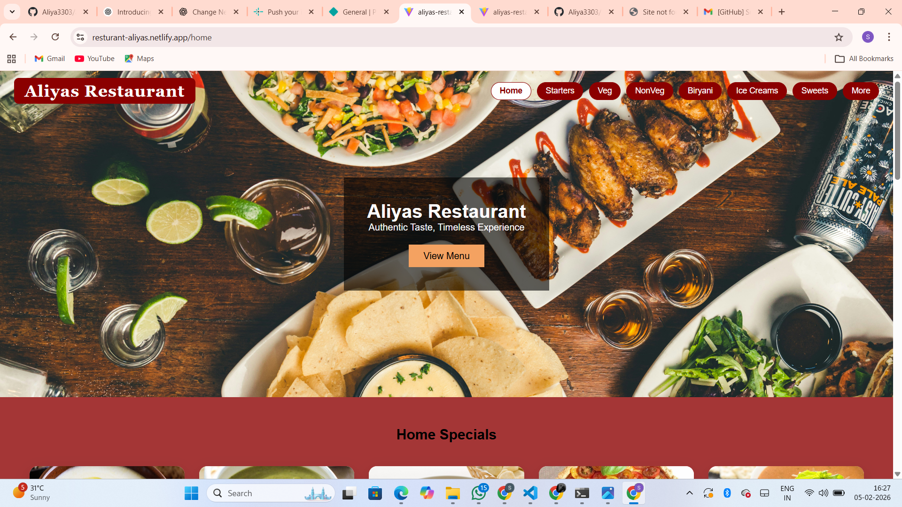
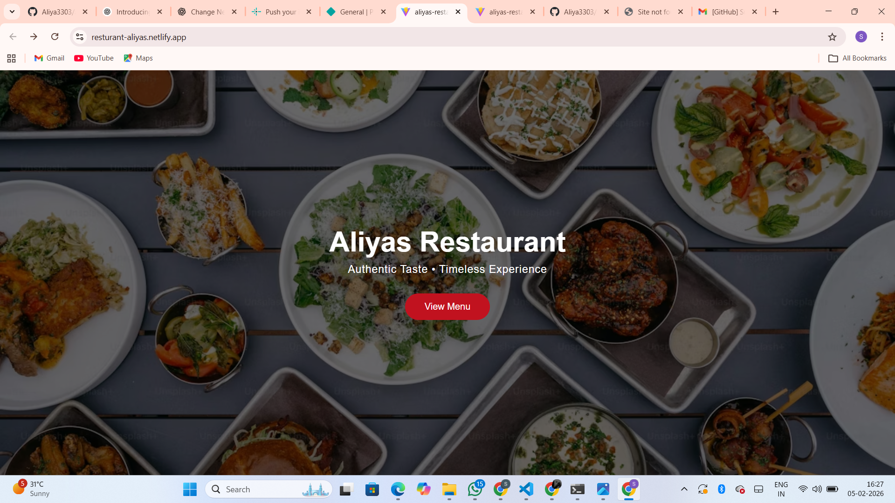
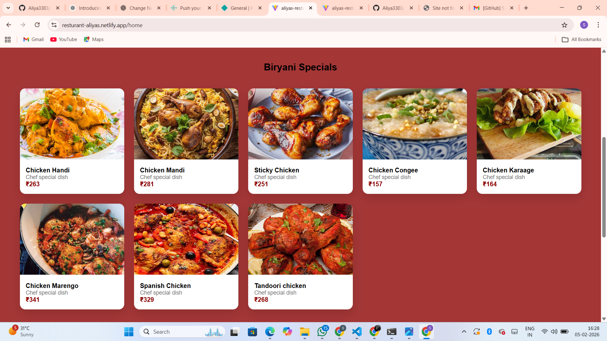
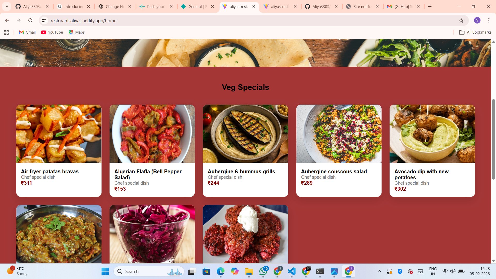
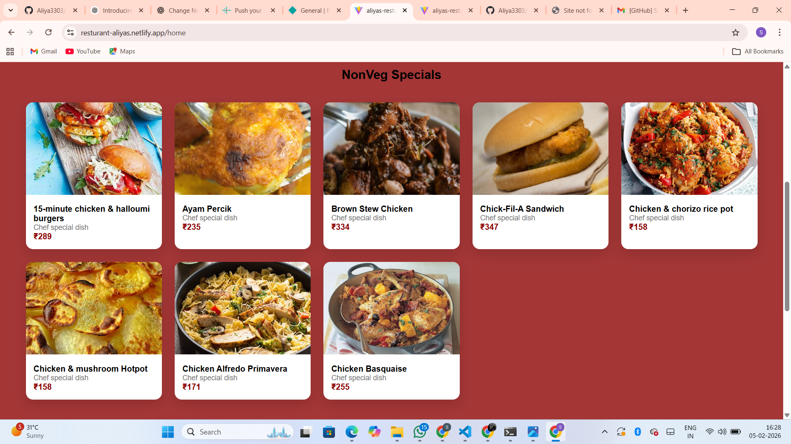
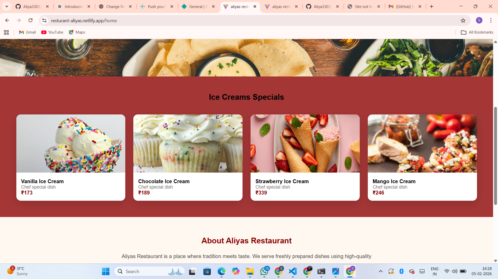
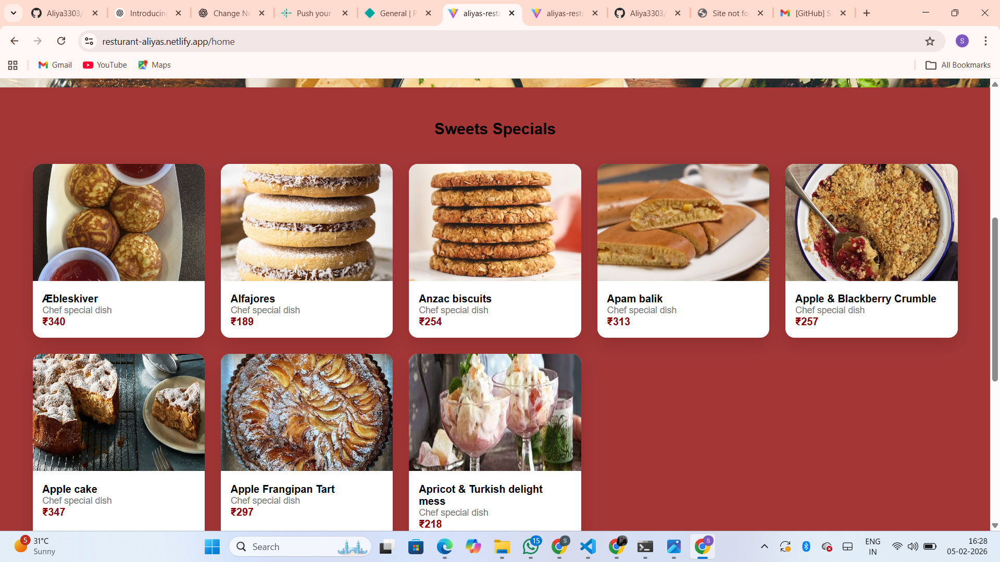

# 🍽️ Aliyas Restaurant Website

A modern and responsive restaurant website built using Vite and frontend web technologies.

## 🚀 Live Demo
👉 https://resturant-aliyas.netlify.app/home

## 🛠️ Tech Stack
- HTML5
- CSS3
- JavaScript
- Vite

## ✨ Features
- Attractive UI design
- Responsive layout
- Food gallery section
- Fast performance with Vite

## 📸 Screenshots

### 🏠 Home Page


### 🌐 Landing Page


### 🍽️ Biriyani


### 🥗 Veg Specials


### 🍗 Non Veg Specials


### 🍨 Ice Creams


### 🍬 Sweets



## 📦 Installation & Run Locally
```bash
npm install
npm run dev
